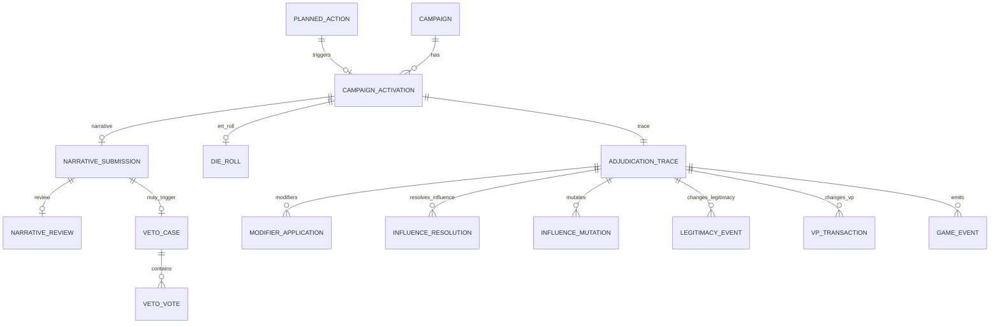

# MALIGN-AI — DATA DICTIONARY & ENTITY RELATIONSHIP SPECIFICATION v0.1

**Fecha:** 2026-08-22  
**Fase:** FASE 1 — MODELO DE DATOS  
**Estado:** DRAFT BASELINE / listo para revisión  
**Código:** NO iniciado  
**Predecesor:** `MALIGN_AI_GAME_DATA_MODEL_SPEC_v0.1.md`

> Este documento convierte el modelo lógico de MALIGN-AI en un diccionario de datos y especificación de relaciones suficientemente preciso para diseñar posteriormente el esquema físico. No es SQL ni código ejecutable.

---

# 1. Objetivo

Cerrar, antes de programar:

- entidades persistentes y su autoridad;
- claves lógicas y cardinalidades;
- tipos de datos lógicos;
- nulabilidad;
- invariantes y restricciones de unicidad;
- ownership y lifecycle;
- índices conceptuales;
- reglas de retención;
- fronteras entre datos normalizados, snapshots y JSON;
- ERD de referencia;
- decisiones todavía técnicas que deben pasar a Fase 1.2/Fase 2.

Principio rector:

```text
Regla oficial / decisión aprobada
            ↓
     Modelo lógico
            ↓
   Diccionario de datos
            ↓
      Esquema físico
            ↓
       Game Engine
```

Nunca al revés.

---

# 2. Convenciones del diccionario

## 2.1 Tipos lógicos

```text
ID            Identificador opaco estable.
TEXT          Cadena UTF-8.
SHORT_TEXT    Cadena corta para nombres/códigos.
BOOL          Booleano.
INT           Entero con signo.
NONNEG_INT    Entero >= 0.
POS_INT       Entero > 0.
DECIMAL       Número decimal exacto si llegara a requerirse.
ENUM          Valor perteneciente a un conjunto cerrado.
TIMESTAMP     Fecha/hora UTC.
JSON          Estructura serializada versionada.
HASH          Hash criptográfico/estado resumido.
```

## 2.2 Claves

- `PK`: primary logical key.
- `FK`: referencia obligatoria o nullable según columna.
- `UK`: unique constraint.
- `CK`: check/invariante local.
- `IDX`: índice conceptual recomendado.

## 2.3 Identificadores

**PROPUESTA TÉCNICA:** usar IDs opacos ordenables temporalmente, preferentemente UUIDv7. No es una regla del juego y puede cambiar al diseñar PostgreSQL.

Nunca usar nombres visibles, números de PD impresos ni índices de asiento como PK permanentes.

---

# 3. Reglas transversales de persistencia

Toda entidad persistente mutable debe incluir, salvo excepción explícita:

| Campo | Tipo | Regla |
|---|---|---|
| `id` | ID | PK |
| `created_at` | TIMESTAMP | obligatorio |
| `updated_at` | TIMESTAMP | obligatorio |
| `row_version` | POS_INT | optimistic concurrency |

Las entidades append-only (`GameEvent`, ledgers, mutaciones, tiradas) no se actualizan funcionalmente después de insertarse; si requieren corrección, se genera un nuevo registro compensatorio.

Las definiciones versionadas además incluyen:

```text
definition_version
status = DRAFT | ACTIVE | RETIRED
source_reference
```

---

# 4. Modelo de ownership y autoridad

Se distinguen cinco conceptos:

```text
ACCOUNT OWNERSHIP      identidad de usuario externo
GAME PARTICIPATION    rol dentro de una partida
COUNTRY CONTROL       país operado por un participante
CARD OWNERSHIP         set nacional al que pertenece una copia
CARD CONTROL           participante que actualmente posee/controla esa copia
```

Invariante MVP:

```text
1 active PLAYER participant -> 1 PlayerSeat -> 1 GameCountry
1 GameCountry -> 1 controlling participant
```

El facilitador es independiente de country control.

---

# 5. REFERENCE DATA

## 5.1 `CountryDefinition`

Datos estables de una facción.

| Campo | Tipo | Null | Restricción |
|---|---|---:|---|
| `id` | SHORT_TEXT | no | PK canónica: `ARDEN`, `FLUMA`, `URSARIA`, `PRESQUE`, `DINESIA` |
| `canonical_name` | SHORT_TEXT | no | UK |
| `regime_type` | SHORT_TEXT | no | texto canónico versionado |
| `mascot` | SHORT_TEXT | no | |
| `color_key` | SHORT_TEXT | no | UK dentro del ruleset |
| `visual_asset_key` | TEXT | sí | |
| `starting_resource_default` | NONNEG_INT | no | CK >=0 |
| `turn_income_default` | NONNEG_INT | no | CK >=0 |
| `regime_ability_definition_id` | ID | no | FK |
| `definition_version` | SHORT_TEXT | no | |
| `status` | ENUM | no | DRAFT/ACTIVE/RETIRED |
| `source_reference` | TEXT | no | |

**Índices:** `status`, `definition_version`.

---

## 5.2 `RegimeAbilityDefinition`

| Campo | Tipo | Null | Restricción |
|---|---|---:|---|
| `id` | ID | no | PK |
| `country_definition_id` | SHORT_TEXT | no | FK, UK por versión |
| `name` | SHORT_TEXT | no | |
| `ap_cost` | NONNEG_INT | no | base=1 |
| `once_per_turn` | BOOL | no | base=true |
| `description` | TEXT | no | |
| `effect_bundle_id` | ID | no | referencia lógica a efectos declarativos |
| `definition_version` | SHORT_TEXT | no | |
| `status` | ENUM | no | |
| `source_reference` | TEXT | no | |

---

## 5.3 `CardDefinition`

Una definición nominal, independiente de cuántas copias existen.

| Campo | Tipo | Null | Restricción |
|---|---|---:|---|
| `id` | ID | no | PK |
| `canonical_name` | SHORT_TEXT | no | UK por registry version |
| `category` | ENUM | no | CAMPAIGN_COMPONENT / ACTION / STARTER |
| `intent_alignment` | ENUM | no | MALIGN / RESILIENCY / DUAL / NONE |
| `is_starter` | BOOL | no | |
| `is_action` | BOOL | no | |
| `is_reaction` | BOOL | no | |
| `remove_after_use` | BOOL | no | |
| `description` | TEXT | sí | |
| `effect_text` | TEXT | sí | texto fuente, no lógica autoritativa |
| `registry_version` | SHORT_TEXT | no | |
| `definition_version` | SHORT_TEXT | no | |
| `source_reference` | TEXT | no | |
| `status` | ENUM | no | |

**CK:** `is_starter=true -> category=STARTER`.  
**CK:** `is_reaction=true -> is_action=true` salvo futura excepción explícita.

---

## 5.4 `CardSlotValue`

| Campo | Tipo | Null | Restricción |
|---|---|---:|---|
| `card_definition_id` | ID | no | FK |
| `slot_type` | ENUM | no | INTENT/METHOD/AMPLIFIER |
| `influence_value` | POS_INT | no | base esperado 1..6 |

**PK compuesta:** (`card_definition_id`, `slot_type`).

---

## 5.5 `CardRequirement`

| Campo | Tipo | Null |
|---|---|---:|
| `id` | ID | no |
| `card_definition_id` | ID | no |
| `requirement_type` | ENUM | no |
| `parameters_json` | JSON | no |
| `order_index` | NONNEG_INT | no |

`parameters_json` debe validarse contra schema por `requirement_type`.

---

## 5.6 `CardEffectDefinition`

| Campo | Tipo | Null |
|---|---|---:|
| `id` | ID | no |
| `card_definition_id` | ID | no |
| `effect_type` | ENUM | no |
| `timing_window` | ENUM | no |
| `parameters_json` | JSON | no |
| `order_index` | NONNEG_INT | no |
| `effect_version` | SHORT_TEXT | no |

**UK:** (`card_definition_id`, `order_index`, `effect_version`).

`parameters_json` nunca contiene código ejecutable ni prompts.

---

## 5.7 `CardAlias`

| Campo | Tipo | Null |
|---|---|---:|
| `id` | ID | no |
| `alias_normalized` | SHORT_TEXT | no |
| `card_definition_id` | ID | no |
| `source_reference` | TEXT | no |
| `locale` | SHORT_TEXT | sí |

**UK:** (`alias_normalized`, `locale`, registry version).

---

## 5.8 `DemographicTokenDefinition`

| Campo | Tipo | Null |
|---|---|---:|
| `id` | ID | no |
| `category` | ENUM | no |
| `canonical_value` | SHORT_TEXT | no |
| `display_label` | SHORT_TEXT | no |
| `visual_asset_key` | TEXT | sí |
| `definition_version` | SHORT_TEXT | no |
| `status` | ENUM | no |

**UK:** (`category`, `canonical_value`, `definition_version`).

Categorías base:

```text
POLITICAL_PARTY
ETHNICITY
RELIGION
EDUCATION
OTHER
```

---

## 5.9 `ERTDefinition`

| Campo | Tipo | Null |
|---|---|---:|
| `id` | ID | no |
| `name` | SHORT_TEXT | no |
| `ruleset_version` | SHORT_TEXT | no |
| `status` | ENUM | no |

---

## 5.10 `ERTCell`

| Campo | Tipo | Null |
|---|---|---:|
| `ert_definition_id` | ID | no |
| `tier` | ENUM | no |
| `die_value` | INT | no |
| `malign_result` | INT | no |
| `resiliency_result` | INT | no |

**PK compuesta:** (`ert_definition_id`,`tier`,`die_value`).  
**CK:** `die_value` 1..10.

---

# 6. SCENARIO DATA

## 6.1 `ScenarioDefinition`

| Campo | Tipo | Null |
|---|---|---:|
| `id` | ID | no |
| `canonical_name` | SHORT_TEXT | no |
| `version` | SHORT_TEXT | no |
| `narrative` | TEXT | no |
| `default_turn_limit` | POS_INT | sí |
| `allows_instant_victory` | BOOL | no |
| `ruleset_version` | SHORT_TEXT | no |
| `card_registry_version` | SHORT_TEXT | no |
| `status` | ENUM | no |
| `source_reference` | TEXT | no |

**UK:** (`canonical_name`,`version`).

---

## 6.2 `ScenarioCountryConfig`

| Campo | Tipo | Null |
|---|---|---:|
| `id` | ID | no |
| `scenario_definition_id` | ID | no |
| `country_definition_id` | SHORT_TEXT | no |
| `starting_resources` | NONNEG_INT | no |
| `turn_income` | NONNEG_INT | no |
| `enabled` | BOOL | no |

**UK:** (`scenario_definition_id`,`country_definition_id`).

---

## 6.3 `ScenarioPDDefinition`

| Campo | Tipo | Null |
|---|---|---:|
| `id` | ID | no |
| `scenario_definition_id` | ID | no |
| `canonical_pd_id` | SHORT_TEXT | no |
| `host_country_id` | SHORT_TEXT | no |
| `local_index` | POS_INT | no |
| `gamebook_label` | SHORT_TEXT | sí |
| `board_label` | SHORT_TEXT | sí |
| `population_size` | ENUM | no |
| `visual_anchor_key` | TEXT | sí |

`population_size = SMALL | MEDIUM | LARGE`.

**UK:** (`scenario_definition_id`,`canonical_pd_id`).  
**UK:** (`scenario_definition_id`,`host_country_id`,`local_index`).

---

## 6.4 `ScenarioPDDemographic`

| Campo | Tipo | Null |
|---|---|---:|
| `scenario_pd_definition_id` | ID | no |
| `demographic_token_definition_id` | ID | no |

**PK compuesta:** ambos campos.

---

## 6.5 `ScenarioInitialInfluence`

| Campo | Tipo | Null |
|---|---|---:|
| `id` | ID | no |
| `scenario_pd_definition_id` | ID | no |
| `influence_type` | ENUM | no |
| `attribution_country_id` | SHORT_TEXT | no |
| `count` | POS_INT | no |
| `source_reference` | TEXT | no |

`influence_type = MALIGN | RESILIENCY`.

---

## 6.6 `ScenarioRuleConfig`

| Campo | Tipo | Null |
|---|---|---:|
| `id` | ID | no |
| `scenario_definition_id` | ID | no |
| `key` | SHORT_TEXT | no |
| `value_json` | JSON | no |
| `rule_version` | SHORT_TEXT | no |

**UK:** (`scenario_definition_id`,`key`,`rule_version`).

Ejemplos: viral threshold, short viral variant, instant victory flag.

---

## 6.7 `VictoryObjectiveDefinition`

| Campo | Tipo | Null |
|---|---|---:|
| `id` | ID | no |
| `scenario_definition_id` | ID | no |
| `country_id` | SHORT_TEXT | no |
| `tier` | ENUM | no |
| `title` | TEXT | no |
| `description` | TEXT | no |
| `points_mode` | ENUM | no |
| `points_value` | INT | no |
| `evaluator_type` | ENUM | no |
| `evaluator_parameters_json` | JSON | no |
| `requires_facilitator_tag` | BOOL | no |
| `instant_victory` | BOOL | no |
| `display_order` | NONNEG_INT | no |

**IDX:** (`scenario_definition_id`,`country_id`,`tier`).

---

# 7. GAME INSTANCE

## 7.1 `Game`

| Campo | Tipo | Null | Restricción |
|---|---|---:|---|
| `id` | ID | no | PK |
| `name` | TEXT | no | |
| `status` | ENUM | no | |
| `ruleset_version` | SHORT_TEXT | no | immutable tras ACTIVE |
| `scenario_definition_id` | ID | no | FK |
| `scenario_version` | SHORT_TEXT | no | immutable tras ACTIVE |
| `card_registry_version` | SHORT_TEXT | no | immutable tras ACTIVE |
| `ert_definition_id` | ID | no | FK |
| `facilitator_user_id` | ID | no | |
| `turn_limit` | POS_INT | no antes de ACTIVE | |
| `dice_mode` | ENUM | no | ENGINE_RNG/MANUAL_INPUT_ALLOWED |
| `beginner_narrative_leniency` | BOOL | no | |
| `viral_variant` | ENUM | no | BASE/SHORT |
| `event_sequence_head` | NONNEG_INT | no | monotónico |
| `started_at` | TIMESTAMP | sí | |
| `ended_at` | TIMESTAMP | sí | |
| `created_at` | TIMESTAMP | no | |
| `updated_at` | TIMESTAMP | no | |
| `row_version` | POS_INT | no | |

Estados: `DRAFT, LOBBY, SETUP, ACTIVE, PAUSED, COMPLETED, ABORTED`.

**IDX:** `status`, `facilitator_user_id`, `created_at`.

---

## 7.2 `GameParticipant`

| Campo | Tipo | Null |
|---|---|---:|
| `id` | ID | no |
| `game_id` | ID | no |
| `user_id` | ID | no |
| `role` | ENUM | no |
| `status` | ENUM | no |
| `joined_at` | TIMESTAMP | no |
| `left_at` | TIMESTAMP | sí |

`role = FACILITATOR | PLAYER | OBSERVER`.  
`status = INVITED | ACTIVE | DISCONNECTED | LEFT | REMOVED`.

**UK:** (`game_id`,`user_id`).

---

## 7.3 `PlayerSeat`

| Campo | Tipo | Null |
|---|---|---:|
| `id` | ID | no |
| `game_id` | ID | no |
| `participant_id` | ID | no |
| `seat_index` | NONNEG_INT | no |
| `clockwise_index` | NONNEG_INT | no |
| `country_id` | SHORT_TEXT | no |

**UK:** (`game_id`,`participant_id`).  
**UK:** (`game_id`,`country_id`).  
**UK:** (`game_id`,`clockwise_index`).

---

## 7.4 `GameCountry`

| Campo | Tipo | Null |
|---|---|---:|
| `id` | ID | no |
| `game_id` | ID | no |
| `country_definition_id` | SHORT_TEXT | no |
| `controlling_participant_id` | ID | no |
| `current_vp_cache` | NONNEG_INT | no |
| `current_resources_cache` | NONNEG_INT | no |
| `legitimacy_count_cache` | NONNEG_INT | no |
| `created_at` | TIMESTAMP | no |
| `updated_at` | TIMESTAMP | no |
| `row_version` | POS_INT | no |

Caches no autoritativos; reconciliables contra ledgers/estado detallado.

**UK:** (`game_id`,`country_definition_id`).

---

# 8. TURN / PHASE / INITIATIVE

## 8.1 `Turn`

| Campo | Tipo | Null |
|---|---|---:|
| `id` | ID | no |
| `game_id` | ID | no |
| `number` | POS_INT | no |
| `status` | ENUM | no |
| `started_at` | TIMESTAMP | sí |
| `ended_at` | TIMESTAMP | sí |

**UK:** (`game_id`,`number`).

---

## 8.2 `PhaseState`

| Campo | Tipo | Null |
|---|---|---:|
| `id` | ID | no |
| `turn_id` | ID | no |
| `phase_type` | ENUM | no |
| `status` | ENUM | no |
| `opened_at` | TIMESTAMP | sí |
| `locked_at` | TIMESTAMP | sí |
| `resolved_at` | TIMESTAMP | sí |

**UK:** (`turn_id`,`phase_type`).

`phase_type = STRATEGY | INITIATIVE | ACTION | RESOLUTION | CLEANUP`.

---

## 8.3 `PlayerPhaseReadiness`

| Campo | Tipo | Null |
|---|---|---:|
| `phase_state_id` | ID | no |
| `participant_id` | ID | no |
| `status` | ENUM | no |
| `locked_at` | TIMESTAMP | sí |

**PK compuesta:** (`phase_state_id`,`participant_id`).

---

## 8.4 `InitiativeRoll`

Append-only.

| Campo | Tipo | Null |
|---|---|---:|
| `id` | ID | no |
| `turn_id` | ID | no |
| `participant_id` | ID | no |
| `attempt_number` | POS_INT | no |
| `die_roll_id` | ID | no |
| `is_tiebreak` | BOOL | no |

**UK:** (`turn_id`,`participant_id`,`attempt_number`).

---

## 8.5 `InitiativeEntry`

| Campo | Tipo | Null |
|---|---|---:|
| `turn_id` | ID | no |
| `participant_id` | ID | no |
| `initiative_position` | POS_INT | no |
| `winning_roll` | INT | no |

**PK compuesta:** (`turn_id`,`participant_id`).  
**UK:** (`turn_id`,`initiative_position`).

---

# 9. PLAYER ECONOMY

## 9.1 `ResourceTransaction`

Append-only.

| Campo | Tipo | Null |
|---|---|---:|
| `id` | ID | no |
| `game_id` | ID | no |
| `turn_id` | ID | sí |
| `participant_id` | ID | no |
| `delta` | INT | no |
| `reason_type` | ENUM | no |
| `source_entity_type` | SHORT_TEXT | sí |
| `source_entity_id` | ID | sí |
| `counterparty_participant_id` | ID | sí |
| `adjudication_trace_id` | ID | sí |
| `created_at` | TIMESTAMP | no |

**IDX:** (`game_id`,`participant_id`,`created_at`), `source_entity_id`.

Saldo resultante nunca <0.

---

## 9.2 `ActionPointLedger`

| Campo | Tipo | Null |
|---|---|---:|
| `id` | ID | no |
| `turn_id` | ID | no |
| `participant_id` | ID | no |
| `allocated` | NONNEG_INT | no |
| `spent` | NONNEG_INT | no |
| `remaining` | NONNEG_INT | no |
| `row_version` | POS_INT | no |

**UK:** (`turn_id`,`participant_id`).  
**CK:** `allocated = spent + remaining`.

---

# 10. CARD INSTANCE / ZONES

## 10.1 `CardInstance`

| Campo | Tipo | Null |
|---|---|---:|
| `id` | ID | no |
| `game_id` | ID | no |
| `country_owner_id` | SHORT_TEXT | no |
| `card_definition_id` | ID | no |
| `serial_within_country_set` | POS_INT | no |
| `current_controller_participant_id` | ID | no |
| `zone` | ENUM | no |
| `face_state` | ENUM | no |
| `removed_from_game` | BOOL | no |
| `row_version` | POS_INT | no |

`zone = OPERATIONS_POOL | OPERATIONS_DECK | HAND | DISCARD | CAMPAIGN_SLOT | PLANNED_ACTION | TEMPORARY_REVEAL | REMOVED_FROM_GAME`.

**UK:** (`game_id`,`country_owner_id`,`serial_within_country_set`).

**IDX:** (`game_id`,`current_controller_participant_id`,`zone`).

---

## 10.2 `DeckCardPosition`

| Campo | Tipo | Null |
|---|---|---:|
| `game_id` | ID | no |
| `participant_id` | ID | no |
| `card_instance_id` | ID | no |
| `position` | POS_INT | no |
| `shuffle_revision` | POS_INT | no |

**PK:** `card_instance_id` por revisión activa, o surrogate ID en físico.  
**UK:** (`participant_id`,`shuffle_revision`,`position`).

**PROPUESTA TÉCNICA:** usar posiciones enteras densas; el shuffle reemplaza el conjunto de posiciones en una única transacción.

---

# 11. CAMPAIGNS

## 11.1 `Campaign`

| Campo | Tipo | Null |
|---|---|---:|
| `id` | ID | no |
| `game_id` | ID | no |
| `owner_participant_id` | ID | no |
| `created_turn_id` | ID | no |
| `row` | ENUM | no |
| `state` | ENUM | no |
| `intent_alignment` | ENUM | no |
| `target_dt_id` | ID | sí |
| `last_activated_turn_id` | ID | sí |
| `activation_count_current_turn_cache` | NONNEG_INT | no |
| `row_version` | POS_INT | no |

**IDX:** (`game_id`,`owner_participant_id`,`state`,`row`).

---

## 11.2 `CampaignCardAssignment`

| Campo | Tipo | Null |
|---|---|---:|
| `id` | ID | no |
| `campaign_id` | ID | no |
| `slot_type` | ENUM | no |
| `card_instance_id` | ID | no |
| `assigned_turn_id` | ID | no |
| `removed_turn_id` | ID | sí |

Para estado actual sólo puede existir una asignación activa por slot.

**Partial UK conceptual:** (`campaign_id`,`slot_type`) WHERE `removed_turn_id IS NULL`.

---

# 12. BOARD STATE

## 12.1 `PopulationDemographicState`

| Campo | Tipo | Null |
|---|---|---:|
| `id` | ID | no |
| `game_id` | ID | no |
| `scenario_pd_definition_id` | ID | no |
| `host_country_id` | SHORT_TEXT | no |
| `current_legitimacy_participant_id` | ID | sí |
| `row_version` | POS_INT | no |

**UK:** (`game_id`,`scenario_pd_definition_id`).

---

## 12.2 `InfluenceStack`

Estado actual agregado por PD/tipo/atribución.

| Campo | Tipo | Null |
|---|---|---:|
| `id` | ID | no |
| `game_id` | ID | no |
| `pd_state_id` | ID | no |
| `influence_type` | ENUM | no |
| `attribution_country_id` | SHORT_TEXT | no |
| `count` | NONNEG_INT | no |
| `row_version` | POS_INT | no |

**UK:** (`pd_state_id`,`influence_type`,`attribution_country_id`).

`count=0` puede eliminarse físicamente de esta tabla de snapshot, siempre que el historial permanezca en `InfluenceMutation`.

---

## 12.3 `InfluenceMutation`

Append-only.

| Campo | Tipo | Null |
|---|---|---:|
| `id` | ID | no |
| `game_id` | ID | no |
| `turn_id` | ID | sí |
| `adjudication_trace_id` | ID | sí |
| `pd_state_id` | ID | no |
| `influence_type` | ENUM | no |
| `attribution_country_id` | SHORT_TEXT | no |
| `delta` | INT | no |
| `mutation_reason` | ENUM | no |
| `source_entity_type` | SHORT_TEXT | sí |
| `source_entity_id` | ID | sí |
| `created_at` | TIMESTAMP | no |

**IDX:** (`pd_state_id`,`created_at`), (`adjudication_trace_id`).

---

## 12.4 `LegitimacyEvent`

Append-only.

| Campo | Tipo | Null |
|---|---|---:|
| `id` | ID | no |
| `game_id` | ID | no |
| `turn_id` | ID | sí |
| `pd_state_id` | ID | no |
| `previous_participant_id` | ID | sí |
| `new_participant_id` | ID | sí |
| `reason_type` | ENUM | no |
| `adjudication_trace_id` | ID | sí |
| `created_at` | TIMESTAMP | no |

---

# 13. ACTION / RESOLUTION

## 13.1 `PlannedAction`

| Campo | Tipo | Null |
|---|---|---:|
| `id` | ID | no |
| `turn_id` | ID | no |
| `participant_id` | ID | no |
| `sequence_within_player` | POS_INT | no |
| `action_type` | ENUM | no |
| `ap_cost` | NONNEG_INT | no |
| `state` | ENUM | no |
| `target_entity_type` | SHORT_TEXT | sí |
| `target_entity_id` | ID | sí |
| `card_instance_id` | ID | sí |
| `campaign_id` | ID | sí |
| `parameters_json` | JSON | sí |
| `locked_at` | TIMESTAMP | sí |
| `row_version` | POS_INT | no |

**UK:** (`turn_id`,`participant_id`,`sequence_within_player`).

Visibility antes de reveal: `OWNER_AND_FACILITATOR`.

---

## 13.2 `ActionResolution`

| Campo | Tipo | Null |
|---|---|---:|
| `id` | ID | no |
| `planned_action_id` | ID | no |
| `initiative_position` | POS_INT | no |
| `resolution_status` | ENUM | no |
| `adjudication_trace_id` | ID | sí |
| `started_at` | TIMESTAMP | no |
| `ended_at` | TIMESTAMP | sí |

**UK:** `planned_action_id`.

---

## 13.3 `ReactionWindow`

| Campo | Tipo | Null |
|---|---|---:|
| `id` | ID | no |
| `game_id` | ID | no |
| `turn_id` | ID | no |
| `window_type` | ENUM | no |
| `triggering_entity_type` | SHORT_TEXT | no |
| `triggering_entity_id` | ID | no |
| `triggering_participant_id` | ID | no |
| `state` | ENUM | no |
| `opened_at` | TIMESTAMP | no |
| `closed_at` | TIMESTAMP | sí |
| `row_version` | POS_INT | no |

**IDX:** (`game_id`,`state`).

---

## 13.4 `ReactionEligibility`

| Campo | Tipo | Null |
|---|---|---:|
| `reaction_window_id` | ID | no |
| `participant_id` | ID | no |
| `priority_order` | POS_INT | no |
| `passed` | BOOL | no |

**PK compuesta:** (`reaction_window_id`,`participant_id`).

Los IDs de cartas elegibles se derivan de CardEffectDefinition y mano actual; no se persiste una lista autoritativa salvo snapshot de auditoría en la ventana.

---

## 13.5 `ReactionPlay`

| Campo | Tipo | Null |
|---|---|---:|
| `id` | ID | no |
| `reaction_window_id` | ID | no |
| `participant_id` | ID | no |
| `card_instance_id` | ID | no |
| `priority_order` | POS_INT | no |
| `resolution_status` | ENUM | no |
| `adjudication_trace_id` | ID | no |
| `created_at` | TIMESTAMP | no |

---

## 13.6 `CampaignActivation`

| Campo | Tipo | Null |
|---|---|---:|
| `id` | ID | no |
| `game_id` | ID | no |
| `turn_id` | ID | no |
| `participant_id` | ID | no |
| `campaign_id` | ID | no |
| `planned_action_id` | ID | sí |
| `activation_source` | ENUM | no |
| `target_pd_state_id` | ID | no |
| `target_dt_id` | ID | no |
| `base_cv` | INT | no |
| `effective_cv` | INT | no |
| `cost_tier` | ENUM | no |
| `resolution_tier` | ENUM | no |
| `tier_resource_cost` | NONNEG_INT | no |
| `card_specific_resource_cost` | NONNEG_INT | no |
| `total_resource_cost` | NONNEG_INT | no |
| `legitimacy_roll_bonus` | INT | no |
| `roll_boost_spent` | BOOL | no |
| `die_roll_id` | ID | sí |
| `modified_roll` | INT | sí |
| `ert_result` | INT | sí |
| `outcome_type` | ENUM | no |
| `adjudication_trace_id` | ID | no |
| `created_at` | TIMESTAMP | no |

**IDX:** (`campaign_id`,`turn_id`), (`participant_id`,`turn_id`).

---

## 13.7 `NarrativeSubmission`

| Campo | Tipo | Null |
|---|---|---:|
| `id` | ID | no |
| `campaign_activation_id` | ID | no |
| `participant_id` | ID | no |
| `text` | TEXT | no |
| `sentence_count` | NONNEG_INT | no |
| `objective_tag_fluma_independence` | BOOL | no |
| `submitted_at` | TIMESTAMP | no |

**UK:** `campaign_activation_id` en base normal.

---

## 13.8 `NarrativeReview`

| Campo | Tipo | Null |
|---|---|---:|
| `id` | ID | no |
| `narrative_submission_id` | ID | no |
| `exceeds_length_rule` | BOOL | no |
| `suspected_card_text_reading` | BOOL | no |
| `facilitator_confirmed_reading_violation` | BOOL | no |
| `facilitator_plausibility_status` | ENUM | no |
| `notes` | TEXT | sí |
| `reviewed_by_participant_id` | ID | sí |
| `reviewed_at` | TIMESTAMP | sí |

**UK:** `narrative_submission_id`.

---

## 13.9 `VetoCase`

| Campo | Tipo | Null |
|---|---|---:|
| `id` | ID | no |
| `game_id` | ID | no |
| `turn_id` | ID | no |
| `narrative_submission_id` | ID | no |
| `veto_card_instance_id` | ID | no |
| `initiator_participant_id` | ID | no |
| `rationale` | TEXT | no |
| `defender_response` | TEXT | sí |
| `state` | ENUM | no |
| `result` | ENUM | sí |
| `resolved_at` | TIMESTAMP | sí |

---

## 13.10 `VetoVote`

| Campo | Tipo | Null |
|---|---|---:|
| `veto_case_id` | ID | no |
| `participant_id` | ID | no |
| `vote` | ENUM | no |
| `cast_at` | TIMESTAMP | no |

**PK compuesta:** (`veto_case_id`,`participant_id`).

---

## 13.11 `DieRoll`

Append-only.

| Campo | Tipo | Null |
|---|---|---:|
| `id` | ID | no |
| `game_id` | ID | no |
| `turn_id` | ID | sí |
| `participant_id` | ID | sí |
| `die_type` | ENUM | no |
| `mode` | ENUM | no |
| `raw_value` | INT | no |
| `source_type` | ENUM | no |
| `source_entity_id` | ID | no |
| `rng_metadata_json` | JSON | sí |
| `entered_by_participant_id` | ID | sí |
| `created_at` | TIMESTAMP | no |

**CK:** D10 -> raw_value 1..10.

---

## 13.12 `ModifierApplication`

Append-only.

| Campo | Tipo | Null |
|---|---|---:|
| `id` | ID | no |
| `adjudication_trace_id` | ID | no |
| `modifier_type` | ENUM | no |
| `source_entity_type` | SHORT_TEXT | no |
| `source_entity_id` | ID | no |
| `value` | INT | no |
| `applied_to` | ENUM | no |
| `stacking_key` | SHORT_TEXT | no |
| `created_at` | TIMESTAMP | no |

**UK conceptual:** (`adjudication_trace_id`,`stacking_key`) cuando la regla no permita stacking.

---

## 13.13 `InfluenceResolution`

| Campo | Tipo | Null |
|---|---|---:|
| `id` | ID | no |
| `adjudication_trace_id` | ID | no |
| `pd_state_id` | ID | no |
| `incoming_type` | ENUM | no |
| `incoming_attribution_country_id` | SHORT_TEXT | no |
| `generated_count` | NONNEG_INT | no |
| `consumed_in_cancellation` | NONNEG_INT | no |
| `opposite_removed_count` | NONNEG_INT | no |
| `placed_count` | NONNEG_INT | no |

**CK:** `generated_count = consumed_in_cancellation + placed_count`.  
**CK:** `consumed_in_cancellation = 2 * opposite_removed_count`.

---

## 13.14 `ViralizationResolution`

| Campo | Tipo | Null |
|---|---|---:|
| `id` | ID | no |
| `game_id` | ID | no |
| `turn_id` | ID | no |
| `origin_pd_state_id` | ID | no |
| `legitimacy_owner_participant_id` | ID | no |
| `influence_type` | ENUM | no |
| `origin_count` | NONNEG_INT | no |
| `threshold` | NONNEG_INT | no |
| `target_pd_state_id` | ID | sí |
| `shares_dt` | BOOL | no |
| `spread_check_die_roll_id` | ID | sí |
| `spread_succeeded` | BOOL | no |
| `quantity_die_roll_id` | ID | sí |
| `cubes_generated` | NONNEG_INT | no |
| `adjudication_trace_id` | ID | no |

---

## 13.15 `RegimeAbilityActivation`

| Campo | Tipo | Null |
|---|---|---:|
| `id` | ID | no |
| `game_id` | ID | no |
| `turn_id` | ID | no |
| `participant_id` | ID | no |
| `ability_definition_id` | ID | no |
| `planned_action_id` | ID | no |
| `die_roll_id` | ID | sí |
| `target_pd_state_id` | ID | sí |
| `adjudication_trace_id` | ID | no |

**UK:** (`turn_id`,`participant_id`,`ability_definition_id`) para once-per-turn base.

---

## 13.16 `AdjudicationTrace`

Entidad central de explicación/replay.

| Campo | Tipo | Null |
|---|---|---:|
| `id` | ID | no |
| `game_id` | ID | no |
| `turn_id` | ID | sí |
| `phase_state_id` | ID | sí |
| `participant_id` | ID | sí |
| `trace_type` | ENUM | no |
| `source_action_id` | ID | sí |
| `source_card_instance_id` | ID | sí |
| `source_campaign_id` | ID | sí |
| `target_pd_state_id` | ID | sí |
| `pre_state_hash` | HASH | no |
| `post_state_hash` | HASH | no |
| `input_snapshot_json` | JSON | no |
| `rule_evaluation_json` | JSON | no |
| `output_snapshot_json` | JSON | no |
| `facilitator_intervention_id` | ID | sí |
| `trace_schema_version` | SHORT_TEXT | no |
| `created_at` | TIMESTAMP | no |

**IDX:** (`game_id`,`turn_id`,`created_at`), `source_action_id`, `source_campaign_id`.

---

# 14. SCORING / OUTCOME

## 14.1 `VPTransaction`

Append-only.

| Campo | Tipo | Null |
|---|---|---:|
| `id` | ID | no |
| `game_id` | ID | no |
| `turn_id` | ID | sí |
| `participant_id` | ID | no |
| `delta` | INT | no |
| `reason_type` | ENUM | no |
| `source_entity_type` | SHORT_TEXT | no |
| `source_entity_id` | ID | no |
| `adjudication_trace_id` | ID | sí |
| `created_at` | TIMESTAMP | no |

**IDX:** (`game_id`,`participant_id`,`created_at`).

---

## 14.2 `VictoryObjectiveProgress`

Privado.

| Campo | Tipo | Null |
|---|---|---:|
| `id` | ID | no |
| `game_id` | ID | no |
| `objective_definition_id` | ID | no |
| `participant_id` | ID | no |
| `current_status_json` | JSON | no |
| `currently_qualifies` | BOOL | no |
| `calculated_at` | TIMESTAMP | no |
| `evaluator_version` | SHORT_TEXT | no |

**UK:** (`game_id`,`objective_definition_id`,`participant_id`).

---

## 14.3 `VictoryObjectiveAward`

Append-only una vez finalizado o en escenario instantáneo.

| Campo | Tipo | Null |
|---|---|---:|
| `id` | ID | no |
| `game_id` | ID | no |
| `objective_definition_id` | ID | no |
| `participant_id` | ID | no |
| `vp_awarded` | NONNEG_INT | no |
| `evaluation_snapshot_json` | JSON | no |
| `awarded_at` | TIMESTAMP | no |

**UK:** (`game_id`,`objective_definition_id`,`participant_id`) en base scenario.

---

## 14.4 `GameOutcome`

| Campo | Tipo | Null |
|---|---|---:|
| `game_id` | ID | no |
| `completed_turn` | POS_INT | no |
| `shared_tie` | BOOL | no |
| `tiebreak_stage` | ENUM | no |
| `final_scores_json` | JSON | no |
| `completed_at` | TIMESTAMP | no |

**PK:** `game_id`.

Ganadores se normalizan en:

```text
GameOutcomeWinner(game_id, participant_id, rank)
```

para evitar arrays como única fuente autoritativa.

---

# 15. COLLABORATION / SECURITY / HUMAN CONTROL

## 15.1 `DealPromise`

No modifica Game State.

| Campo | Tipo | Null |
|---|---|---:|
| `id` | ID | no |
| `game_id` | ID | no |
| `turn_id` | ID | sí |
| `proposer_participant_id` | ID | no |
| `terms_text` | TEXT | no |
| `visibility_scope` | ENUM | no |
| `state` | ENUM | no |
| `created_at` | TIMESTAMP | no |
| `expires_at` | TIMESTAMP | sí |

Participantes del acuerdo se normalizan con `DealParticipant`.

---

## 15.2 `TransferTransaction`

| Campo | Tipo | Null |
|---|---|---:|
| `id` | ID | no |
| `game_id` | ID | no |
| `turn_id` | ID | no |
| `transfer_type` | ENUM | no |
| `from_participant_id` | ID | no |
| `to_participant_id` | ID | no |
| `card_instance_id` | ID | sí |
| `resource_amount` | POS_INT | sí |
| `state` | ENUM | no |
| `confirmed_by_from` | BOOL | no |
| `confirmed_by_to` | BOOL | no |
| `executed_at` | TIMESTAMP | sí |
| `row_version` | POS_INT | no |

**CK:** CARD -> card_instance_id non-null, resource_amount null.  
**CK:** RESOURCE -> resource_amount non-null, card_instance_id null.

---

## 15.3 `TemporaryReveal`

| Campo | Tipo | Null |
|---|---|---:|
| `id` | ID | no |
| `game_id` | ID | no |
| `source_effect_id` | ID | no |
| `viewer_participant_id` | ID | no |
| `target_participant_id` | ID | no |
| `scope` | ENUM | no |
| `opened_at` | TIMESTAMP | no |
| `expires_at_event_id` | ID | sí |
| `closed_at` | TIMESTAMP | sí |

Las cartas reveladas se normalizan en `TemporaryRevealCard`.

---

## 15.4 `VisibilityGrant`

Sólo excepciones, no política base.

| Campo | Tipo | Null |
|---|---|---:|
| `id` | ID | no |
| `game_id` | ID | no |
| `subject_type` | SHORT_TEXT | no |
| `subject_id` | ID | no |
| `viewer_type` | ENUM | no |
| `viewer_id` | ID | sí |
| `permission` | ENUM | no |
| `source` | SHORT_TEXT | no |
| `expires_at` | TIMESTAMP | sí |

---

## 15.5 `FacilitatorDecision`

Append-only como decisión; correcciones generan eventos/mutaciones compensatorias.

| Campo | Tipo | Null |
|---|---|---:|
| `id` | ID | no |
| `game_id` | ID | no |
| `turn_id` | ID | sí |
| `participant_id` | ID | sí |
| `decision_type` | ENUM | no |
| `target_entity_type` | SHORT_TEXT | no |
| `target_entity_id` | ID | no |
| `rationale` | TEXT | no |
| `before_snapshot_json` | JSON | sí |
| `after_snapshot_json` | JSON | sí |
| `created_by_participant_id` | ID | no |
| `created_at` | TIMESTAMP | no |

---

# 16. EVENT LOG

## 16.1 `GameEvent`

Append-only y secuenciado estrictamente por partida.

| Campo | Tipo | Null |
|---|---|---:|
| `id` | ID | no |
| `game_id` | ID | no |
| `sequence_number` | POS_INT | no |
| `turn_id` | ID | sí |
| `phase_state_id` | ID | sí |
| `event_type` | ENUM/TEXT VERSIONADO | no |
| `actor_participant_id` | ID | sí |
| `subject_type` | SHORT_TEXT | sí |
| `subject_id` | ID | sí |
| `payload_json` | JSON | no |
| `payload_schema_version` | SHORT_TEXT | no |
| `visibility_class` | ENUM | no |
| `caused_by_event_id` | ID | sí |
| `adjudication_trace_id` | ID | sí |
| `created_at` | TIMESTAMP | no |

**UK:** (`game_id`,`sequence_number`).  
**IDX:** (`game_id`,`turn_id`,`sequence_number`), `event_type`, `adjudication_trace_id`.

`payload_json` describe el evento; no sustituye ledgers/tablas normalizadas.

---

# 17. MATRIZ DE AUTORIDAD DE DATOS

| Dato | Autoridad primaria | Cache/derivado permitido |
|---|---|---|
| Recursos | `ResourceTransaction` + saldo validado | `GameCountry.current_resources_cache` |
| AP | `ActionPointLedger` | UI cache |
| VP | `VPTransaction` | `GameCountry.current_vp_cache` |
| Mano | `CardInstance.zone/control` | hand count |
| Orden de mazo | `DeckCardPosition` | lista materializada |
| Campaña actual | `Campaign` + assignments activos | snapshot UI |
| Influencia | `InfluenceStack` | totales por PD |
| Historial influencia | `InfluenceMutation` | no |
| Legitimidad actual | `PDState.current_legitimacy_participant_id` | count cache |
| Historial legitimidad | `LegitimacyEvent` | no |
| Iniciativa | `InitiativeEntry` | display cache |
| Resultado ERT | `CampaignActivation` + `AdjudicationTrace` | UI result |
| Victory Objective | definition + evaluator | `VictoryObjectiveProgress` |
| Resultado final | `GameOutcome` + VP ledger | leaderboard cache |
| Replay | `GameEvent` + RNG/decisiones | snapshots opcionales |

---

# 18. REGLAS DE DELETE / RETENCIÓN

## 18.1 Nunca hard-delete durante vida histórica

No se deben borrar físicamente:

- `GameEvent`;
- `AdjudicationTrace`;
- `DieRoll`;
- `ResourceTransaction`;
- `VPTransaction`;
- `InfluenceMutation`;
- `LegitimacyEvent`;
- `FacilitatorDecision`;
- votos de Veto;
- resultados finales.

## 18.2 Definiciones

`CardDefinition`, `ScenarioDefinition`, etc. se retiran mediante `status=RETIRED`; una partida histórica conserva la referencia/version.

## 18.3 Game state transitorio

Snapshots/caches pueden reconstruirse y eventualmente compactarse, pero nunca antes de verificar integridad del event log y ledgers.

---

# 19. Reglas de concurrencia

Operaciones que deben ser atómicas:

1. spend resource + registrar transacción + actualizar cache;
2. draw card + mover zone + actualizar deck positions;
3. transfer card/resource;
4. lock de Action Stage del jugador;
5. campaign card replacement;
6. ERT adjudication completa;
7. 2:1 con selección de atribuciones removidas;
8. legitimacy establish/subvert;
9. VP settlement;
10. Veto resolution;
11. Reaction priority advance;
12. GameEvent sequence allocation.

No se permiten escrituras cliente-directas sobre tablas autoritativas.

---

# 20. Índices conceptuales mínimos

Además de PK/UK:

```text
Game(status, created_at)
GameParticipant(game_id, role, status)
PlayerSeat(game_id, clockwise_index)
Turn(game_id, number)
PhaseState(turn_id, phase_type)
CardInstance(game_id, current_controller_participant_id, zone)
CardInstance(game_id, card_definition_id)
Campaign(game_id, owner_participant_id, state, row)
InfluenceStack(pd_state_id, influence_type, attribution_country_id)
InfluenceMutation(game_id, pd_state_id, created_at)
PlannedAction(turn_id, participant_id, state, sequence_within_player)
ReactionWindow(game_id, state, opened_at)
CampaignActivation(game_id, turn_id, participant_id)
GameEvent(game_id, sequence_number)
GameEvent(game_id, event_type, sequence_number)
AdjudicationTrace(game_id, turn_id, created_at)
VPTransaction(game_id, participant_id, created_at)
ResourceTransaction(game_id, participant_id, created_at)
VictoryObjectiveProgress(game_id, participant_id)
```

No crear índices secundarios prematuramente para todos los FK hasta observar patrones reales; los anteriores son baseline funcional.

---

# 21. Cardinalidades principales

```text
CountryDefinition 1 ── 1 RegimeAbilityDefinition
CardDefinition    1 ── 0..3 CardSlotValue
CardDefinition    1 ── * CardEffectDefinition
CardDefinition    1 ── * CardRequirement
CardDefinition    1 ── * CardAlias

ScenarioDefinition 1 ── 5 ScenarioCountryConfig [base]
ScenarioDefinition 1 ── 14 ScenarioPDDefinition [base]
ScenarioDefinition 1 ── * VictoryObjectiveDefinition
ScenarioPDDefinition 1 ── * ScenarioPDDemographic
ScenarioPDDefinition 1 ── * ScenarioInitialInfluence

Game 1 ── * GameParticipant
Game 1 ── 5 PlayerSeat [MVP active game]
Game 1 ── 5 GameCountry
Game 1 ── * Turn
Game 1 ── 14 PopulationDemographicState [base]
Game 1 ── 540 CardInstance [5 x 108 physical copies]

Turn 1 ── 5 PhaseState
Turn 1 ── * PlannedAction
Turn 1 ── * DieRoll
Turn 1 ── 5 InitiativeEntry [MVP full game]

Player 1 ── * CardInstance [current control]
Player 1 ── * Campaign
Player 1 ── * ResourceTransaction
Player 1 ── * VPTransaction

Campaign 1 ── 2..3 active CampaignCardAssignment when activatable
Campaign 1 ── * CampaignActivation

PDState 1 ── * InfluenceStack
PDState 1 ── 0..1 current legitimacy participant
PDState 1 ── * InfluenceMutation
PDState 1 ── * LegitimacyEvent

PlannedAction 1 ── 0..1 ActionResolution
ActionResolution 1 ── 0..1 AdjudicationTrace
ReactionWindow 1 ── * ReactionEligibility
ReactionWindow 1 ── * ReactionPlay
CampaignActivation 1 ── 1 NarrativeSubmission [except cancelled before narrative]
CampaignActivation 1 ── 1 AdjudicationTrace
```

---

# 22. ERD — vista de dominios

```mermaid
erDiagram
    COUNTRY_DEFINITION ||--|| REGIME_ABILITY_DEFINITION : has
    CARD_DEFINITION ||--o{ CARD_SLOT_VALUE : supports
    CARD_DEFINITION ||--o{ CARD_EFFECT_DEFINITION : defines
    CARD_DEFINITION ||--o{ CARD_REQUIREMENT : requires
    CARD_DEFINITION ||--o{ CARD_ALIAS : aliases

    SCENARIO_DEFINITION ||--o{ SCENARIO_COUNTRY_CONFIG : configures
    SCENARIO_DEFINITION ||--o{ SCENARIO_PD_DEFINITION : contains
    SCENARIO_DEFINITION ||--o{ VICTORY_OBJECTIVE_DEFINITION : defines
    SCENARIO_PD_DEFINITION ||--o{ SCENARIO_PD_DEMOGRAPHIC : tagged_by
    SCENARIO_PD_DEFINITION ||--o{ SCENARIO_INITIAL_INFLUENCE : initializes

    GAME ||--o{ GAME_PARTICIPANT : includes
    GAME ||--o{ PLAYER_SEAT : seats
    GAME ||--o{ GAME_COUNTRY : instantiates
    GAME ||--o{ TURN : contains
    GAME ||--o{ CARD_INSTANCE : owns_instances
    GAME ||--o{ POPULATION_DEMOGRAPHIC_STATE : instantiates

    GAME_PARTICIPANT ||--o| PLAYER_SEAT : occupies
    GAME_PARTICIPANT ||--o{ CAMPAIGN : owns
    GAME_PARTICIPANT ||--o{ RESOURCE_TRANSACTION : resources
    GAME_PARTICIPANT ||--o{ VP_TRANSACTION : scores

    TURN ||--o{ PHASE_STATE : contains
    TURN ||--o{ INITIATIVE_ROLL : rolls
    TURN ||--o{ INITIATIVE_ENTRY : orders
    TURN ||--o{ PLANNED_ACTION : plans

    CARD_DEFINITION ||--o{ CARD_INSTANCE : instantiates
    CAMPAIGN ||--o{ CAMPAIGN_CARD_ASSIGNMENT : contains
    CARD_INSTANCE ||--o{ CAMPAIGN_CARD_ASSIGNMENT : assigned
    CAMPAIGN ||--o{ CAMPAIGN_ACTIVATION : activates

    POPULATION_DEMOGRAPHIC_STATE ||--o{ INFLUENCE_STACK : contains
    POPULATION_DEMOGRAPHIC_STATE ||--o{ INFLUENCE_MUTATION : history
    POPULATION_DEMOGRAPHIC_STATE ||--o{ LEGITIMACY_EVENT : legitimacy_history

    PLANNED_ACTION ||--o| ACTION_RESOLUTION : resolves
    CAMPAIGN_ACTIVATION ||--|| ADJUDICATION_TRACE : traced_by
    REACTION_WINDOW ||--o{ REACTION_ELIGIBILITY : prioritizes
    REACTION_WINDOW ||--o{ REACTION_PLAY : receives

    GAME ||--o{ GAME_EVENT : event_log
    GAME ||--o{ ADJUDICATION_TRACE : traces
```



---

# 23. ERD — adjudicación de campaña



---

# 24. Visibility binding por entidad

| Entidad | Baseline |
|---|---|
| `Game`, turno/fase | PUBLIC |
| `GameParticipant`, asiento, país | PUBLIC |
| recursos actuales | PUBLIC |
| VP actuales | PUBLIC |
| `CardDefinition` | PUBLIC reference |
| `CardInstance` en mano | OWNER_AND_FACILITATOR |
| orden futuro del deck | SYSTEM_ONLY |
| discard visible | PUBLIC |
| campaña face-down | OWNER_AND_FACILITATOR; existencia pública sólo si el estado físico la hace visible |
| `PlannedAction` pre-reveal | OWNER_AND_FACILITATOR |
| `NarrativeSubmission` | PUBLIC tras submit |
| `VictoryObjectiveDefinition` individual | OWNER_AND_FACILITATOR durante partida |
| `VictoryObjectiveProgress` | OWNER_AND_FACILITATOR |
| `TemporaryReveal` | TEMPORARY_AUTHORIZED_VIEWERS |
| `FacilitatorDecision` sensible | FACILITATOR_ONLY o PUBLIC según decisión |
| `GameEvent` | depende de `visibility_class` |
| `AdjudicationTrace` | FACILITATOR + vista redactada pública/owner según caso |

La misma fila puede tener una representación redactada distinta por rol; no se entrega el objeto completo y luego se confía en la UI/LLM para ocultarlo.

---

# 25. JSON: uso permitido y prohibido

## Permitido

- snapshots de auditoría;
- parámetros versionados de Effect DSL;
- evaluator AST de objetivos;
- payload de eventos;
- estado derivado de progreso;
- metadatos RNG;
- configuraciones extensibles de escenario.

## Prohibido como única fuente de verdad

- saldo de recursos;
- VP;
- ownership/control de cartas;
- campañas/slots actuales;
- cubos por atribución;
- legitimidad actual;
- orden de iniciativa;
- resultado de voto;
- resultado de dado.

---

# 26. Decisiones técnicas adoptadas para el baseline lógico

Estas decisiones son de **modelo**, no de reglas de Malign.

### DM-001 — IDs
Usar identificadores opacos; evitar PK derivadas del material impreso.

### DM-002 — Ledgers
Recursos y VP se registran append-only; los contadores actuales son cache.

### DM-003 — Influence
Estado actual agregado en `InfluenceStack`; cambios históricos append-only en `InfluenceMutation`.

### DM-004 — Deck ordering
Representación por posiciones enteras revisionadas, no linked list.

### DM-005 — Ganadores
Normalizar winners mediante `GameOutcomeWinner`; no depender de array JSON.

### DM-006 — Reaction eligibility
Persistir prioridad/passed, pero derivar cartas elegibles desde efectos + mano; snapshots en trace/event para auditoría.

### DM-007 — JSON DSL
Se permite como configuración declarativa versionada, nunca como código arbitrario ni prompt.

### DM-008 — Soft retirement
Reference/Scenario definitions se retiran, no se eliminan si existen partidas que las referencian.

---

# 27. Constraints cross-entity que deberá imponer el Game Engine

Varias reglas no son simples checks SQL y deben validarse en dominio/transacción:

1. exactamente cinco países antes de comenzar el MVP;
2. país no puede tener dos controladores activos;
3. Operations Deck inicial exactamente 30 non-Starter;
4. mano <=10 después de operación atómica;
5. una carta sólo puede estar en una zona lógica a la vez;
6. carta en campaign slot debe estar asignada a esa campaña;
7. Intent + Method obligatorios para activar;
8. alignment compatible en todos los slots;
9. target PD comparte DT con Intent;
10. AP suficiente antes de lock;
11. recursos suficientes antes de resolución;
12. reacción debe tener trigger y prioridad válidos;
13. una campaña normal no se activa dos veces salvo efecto explícito;
14. Regime Ability once-per-turn;
15. máximo 3 legitimidades por jugador;
16. 2:1 debe ejecutarse atómicamente con selección de atribución;
17. Veto antes de die roll;
18. VP y legitimidad dependen de cubos realmente colocados cuando la fuente es campaña;
19. cubos directos no generan VP/legitimidad por defecto;
20. sólo facilitator autorizado puede generar manual corrections.

---

# 28. Integridad de replay

Para considerar una partida reproducible deben existir:

```text
Game pinned versions
+ initial scenario snapshot
+ card instance mapping
+ initial shuffle/draw events
+ every GameEvent sequence
+ every DieRoll raw value
+ every target selection
+ every reaction/vote
+ every facilitator intervention
+ every domain mutation ledger
```

Un replay histórico usa resultados almacenados. No vuelve a:

- tirar dados;
- pedir juicio a IA;
- recalcular narrativa con un modelo posterior;
- reinterpretar reglas nuevas.

---

# 29. Criterios de aceptación de este entregable

La especificación de diccionario se considera suficiente para avanzar cuando:

- cada aggregate root tiene PK/FK/cardinalidad;
- valores críticos tienen autoridad definida;
- no existe dependencia de JSON para invariantes fundamentales;
- la privacidad tiene binding por entidad;
- las mutaciones críticas son auditables;
- existe un ERD suficiente para derivar esquema físico;
- las decisiones pendientes ya son de implementación, no de semántica de juego.

Este documento cumple esos criterios para el baseline v0.1.

---

# 30. Pendientes de Fase 1.2

No bloquean el modelo conceptual, pero deben cerrarse al diseñar el esquema físico:

1. UUIDv7 definitivo vs alternativa equivalente.
2. PostgreSQL ENUM vs lookup tables/versioned domains.
3. especificación formal del Card Effect DSL.
4. especificación formal del Victory Objective Evaluator DSL.
5. estructura de hashes/snapshots para `AdjudicationTrace`.
6. política de redacción (`projection`) de traces/events por rol.
7. estrategia de idempotency keys para API/event processing.
8. transacciones/locks concretos en PostgreSQL.
9. política de archivado de partidas completadas.
10. normalización completa de `event_type`, `reason_type` y otros enums operativos.

---

# 31. Próximo entregable

Antes de iniciar programación, el siguiente documento debe ser:

**MALIGN-AI — ADJUDICATION ENGINE SPECIFICATION v0.1**

Debe definir, paso a paso y con precondiciones/postcondiciones:

- validación de acciones;
- construcción/modificación de campañas;
- cálculo de CV/cost tier/resolution tier;
- pago de costes;
- ventanas de reacción;
- narrativa y Veto;
- tiradas y modificadores;
- consulta ERT;
- backlash;
- 2:1;
- legitimidad;
- VP;
- viralización;
- Regime Abilities;
- Action Cards;
- Cleanup;
- evaluación de VOs;
- victoria;
- intervención del facilitador;
- emisión de `GameEvent` y `AdjudicationTrace`.

**No se inicia código todavía.**
